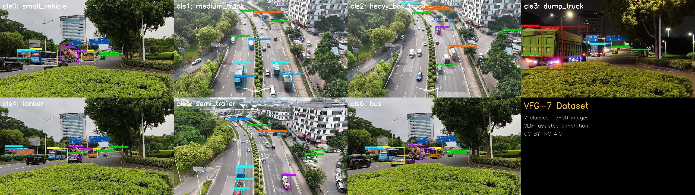

[中文](README.md) | **English**

# VFG-7: Vehicle Fine-Grained 7-Class Detection Dataset

### VFG-7 Dataset

<p align="center">
  
</p>

A fine-grained vehicle detection dataset with **7 classes**,  **VFG-7 Dataset** in a . The dataset is derived from a traffic volume survey project in Dongguan, China. The open-source version contains **3,600 selected images** from a larger pool of **50,000+ original traffic images** (about **7%**), with about 50,000 bounding boxes and 10,784 AI-generated structured descriptions.

The original data covers daytime/nighttime scenes and multiple viewpoints, including roadside cameras, roadside mobile-phone recordings, and UAV aerial views. For access to the complete dataset, please contact: **tianwenkang123@163.com**.

[](https://creativecommons.org/licenses/by-nc/4.0/)
[](https://huggingface.co/datasets/Telody1220/VFG-7)
[](https://www.modelscope.cn/datasets/Telody/VFG-7)

---

## Highlights

- **7 fine-grained vehicle classes** — Goes beyond the typical car/bus/truck taxonomy
- **AI-enriched annotations** — Each detection box has structured descriptions (vehicle type, color, body structure, etc.)
- **Real-world traffic scenes** — Derived from a traffic volume survey project in Dongguan, China, covering daytime/nighttime and multiple viewpoints
- **YOLO-ready** — Standard YOLO format, plug-and-play with Ultralytics

---

## Classes

| ID | English | Chinese | Description |
|----|---------|---------|-------------|
| 0 | `small_vehicle` | 小客车 | Sedans, SUVs, minivans, pickups |
| 1 | `medium_truck` | 中型货车 | Medium-duty trucks (2-axle cargo) |
| 2 | `heavy_box_truck` | 重型厢式货车 | Heavy box/container trucks |
| 3 | `dump_truck` | 自卸车 | Dump trucks |
| 4 | `tanker` | 罐体车 | Tanker trucks (fuel, cement mixer) |
| 5 | `semi_trailer` | 半挂车 | Semi-trailers, articulated trucks |
| 6 | `bus` | 大客车 | Buses, coaches |

---

## Statistics

| Split | Images | Boxes | Format |
|-------|--------|-------|--------|
| Train | 3,000 | ~42k | YOLO |
| Val | 600 | ~8k | YOLO |
| **Open-source subset** | **3,600** | **~50k** | Selected from 50,000+ original images (~7%) |

| Additional | Count |
|------------|-------|
| AI Structured Descriptions | 10,784 |

### Class Distribution

| Class | Train | Val |
|-------|-------|-----|
| small_vehicle | 429 | 236 |
| medium_truck | 600 | 73 |
| heavy_box_truck | 434 | 117 |
| dump_truck | 429 | 35 |
| tanker | 64 | 16 |
| semi_trailer | 570 | 87 |
| bus | 474 | 36 |

---

## Directory Structure

```
VFG-7/
├── images/
│   ├── train/   (3,000 images, 1920×1080 JPEG)
│   └── val/     (600 images)
├── labels/
│   ├── train/   (YOLO format .txt)
│   └── val/
├── vlm_annotations.json   (AI structured descriptions)
├── data.yaml              (YOLO config)
├── README.md
└── LICENSE
```

---

## Quick Start

### Download

```bash
# Option 1: HuggingFace (International)
pip install huggingface_hub
huggingface-cli download Telody1220/VFG-7 --repo-type dataset --local-dir ./VFG-7

# Option 2: ModelScope (Recommended for China)
pip install modelscope
modelscope download --dataset Telody/VFG-7 --local_dir ./VFG-7

# Option 3: Git clone
git clone https://huggingface.co/datasets/Telody1220/VFG-7
```

### Train

```python
from ultralytics import YOLO

model = YOLO("yolo11l.pt")
results = model.train(
    data="VFG-7/data.yaml",
    epochs=50,
    imgsz=1280,
    batch=8,
)
```

### Baseline Results (YOLO11L, imgsz=1280)

| Metric | Value |
|--------|-------|
| mAP50 | 0.673 |
| mAP50-95 | 0.521 |
| P | 0.68 |
| R | 0.65 |

---

## AI Structured Descriptions

Each image may have associated AI-generated structured descriptions in `vlm_annotations.json`:

```json
{
  "image": "16C001_000060.jpg",
  "track_id": 2,
  "vehicle_type": "轿车",
  "color": "黑色",
  "body_structure": "一体式",
  "estimated_length": "6-10m",
  "cargo_type": "无",
  "desc": "黑色特斯拉轿车行驶中",
  "agreement": 1.0
}
```

### Annotation Method

The dataset uses an **AI-assisted + human-reviewed** annotation workflow for vehicle detection, fine-grained category labeling, and quality checking across multiple viewpoints. This public documentation intentionally describes only the high-level workflow and does not disclose implementation details.

---

## Annotation Methodology

### Why 7 Classes?

Standard vehicle detection datasets typically use 2-3 coarse classes (car, truck, bus). However, traffic engineering applications require finer granularity for accurate traffic flow analysis, particularly for:

- **PCU (Passenger Car Unit) estimation** — Different vehicle types have different road occupancy
- **Road wear assessment** — Heavy vehicles cause disproportionate road damage
- **Traffic regulation** — Certain vehicle types face route/time restrictions

### AI-Assisted Labeling

Traditional annotation requires domain experts to distinguish visually similar vehicle types (e.g., medium truck vs. heavy box truck). AI-assisted labeling helps improve consistency and efficiency, followed by human review for quality control.

---

## Links

| Platform | URL |
|----------|-----|
| GitHub | https://github.com/telody/VFG-7 |
| Gitee | https://gitee.com/telody/vfg-7 |
| HuggingFace | https://huggingface.co/datasets/Telody1220/VFG-7 |
| ModelScope | https://www.modelscope.cn/datasets/Telody/VFG-7 |

---

## Citation

```bibtex
@dataset{vfg7_2026,
  title={VFG-7: Vehicle Fine-Grained 7-Class Detection Dataset},
  author={VFG-7 Dataset},
  year={2026},
  url={https://github.com/telody/VFG-7},
  license={CC BY-NC 4.0}
}
```

---

## License

This dataset is released under [CC BY-NC 4.0](https://creativecommons.org/licenses/by-nc/4.0/).

- **Attribution** — You must give appropriate credit.
- **NonCommercial** — You may not use the material for commercial purposes.

---

## Acknowledgments

- Dataset  **VFG-7 Dataset** in a 
- Vehicle detection powered by [Ultralytics YOLO](https://github.com/ultralytics/ultralytics)
- AI-assisted annotation used to improve fine-grained labeling efficiency and consistency
- Data derived from a traffic volume survey project in Dongguan, China
